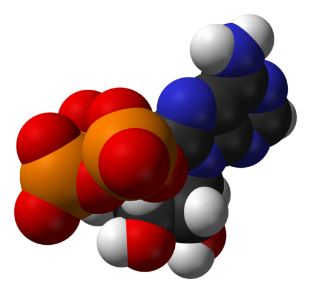

`adenosine`: enthusiast-grade implementation of atproto.com in Rust
===================================================================

**Status:** it doesn't really work yet and will eat your data

This is a hobby project to implement components of the proposed Bluesky AT
Protocol ([atproto.com](https://atproto.com)) for federated social media, as
initially announced in Fall 2022. This might be interesting for other folks to
take a spin with, but isn't intended to host real content from real people. The
goal is to think through how the protocol might work by implementing it.

Components:

- `adenosine-cli` ([README](./adenosine-cli/README.md): command-line client (`adenosine`)
- `adenosine-pds` ([README](./adenosine-pds/README.md): "small world" personal data server implementation, with data in sqlite

## Development and Contributions

Minimum Supported Rust Version (MSRV) is currently 1.61, using 2021 Rust
Edition.

Contributions, conversations, bug reports, and handwriten postcards are all
welcome. This is a low-effort hobby project so high-touch support, feature
requests, growth strategies, etc, probably will not be fielded.

The source code license is AGPLv3. Please acknowledge this in any initial
contributions, and also indicate whether and how you would like to be
acknowledged as a contributor (eg, a name and optionally a URL).
